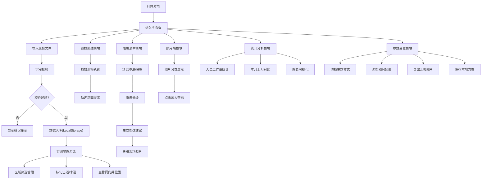

## 1. 产品概述

智慧水务巡检看板是一款纯前端应用，用于离线演示和现场汇报，帮助水务管理人员直观展示管网巡检工作成果，支持数据导入、地图可视化、隐患管理和统计分析等全流程功能。

- 主要用途：水务巡检工作的离线演示、现场汇报、数据可视化分析
- 解决问题：传统巡检数据零散、展示不直观、汇报材料准备繁琐等问题
- 目标用户：水务公司管理人员、巡检人员、汇报演示人员
- 产品价值：提升巡检数据可视化水平，简化汇报流程，支持离线环境下的完整功能演示

## 2. 核心功能

### 2.1 用户角色

| 角色 | 注册方式 | 核心权限 |
|------|---------|---------|
| 演示人员 | 无需注册，纯前端使用 | 全部功能，包括数据导入、参数设置、导出保存 |

### 2.2 功能模块

1. **数据导入模块**：巡检文件导入、字段校验、数据预览、导入进度
2. **管网地图模块**：管段可视化、区域筛选、阀门井标记、已巡/未巡状态展示
3. **巡检路线模块**：巡检轨迹展示、轨迹播放、巡检点标记、路线进度
4. **隐患清单模块**：渗漏/堵塞登记、隐患分级、整改建议、状态跟踪
5. **照片墙模块**：现场照片展示、隐患关联、放大查看、照片分类
6. **统计分析模块**：人员工作量统计、问题类型统计、本月上月对比、趋势图表
7. **参数设置模块**：主题切换、图例调整、导出汇报图片、保存本地方案

### 2.3 页面详情

| 页面名称 | 模块名称 | 功能描述 |
|---------|---------|---------|
| 主看板 | 顶部导航 | 模块切换、主题切换、导出功能入口 |
| 主看板 | 数据导入 | 拖拽上传文件、字段映射、校验结果展示、数据预览表格 |
| 主看板 | 管网地图 | SVG/Canvas管网图、区域筛选下拉、管段颜色编码、阀门井图标、已巡未巡图例 |
| 主看板 | 巡检路线 | 轨迹动画播放控制、进度条、巡检点时间轴、播放速度调节 |
| 主看板 | 隐患清单 | 隐患列表、分级标签、状态筛选、新增隐患表单、整改建议自动生成 |
| 主看板 | 照片墙 | 瀑布流照片展示、分类标签、点击放大、关联隐患信息 |
| 主看板 | 统计分析 | 多种图表（柱状图、饼图、折线图）、人员工作量排名、月度对比卡片、趋势分析 |
| 主看板 | 参数设置 | 主题选择器、图例颜色配置、导出图片格式选择、方案保存/加载 |

## 3. 核心流程

### 3.1 主业务流程

用户打开应用后，首先进入主看板界面。可以选择导入巡检数据文件，系统自动校验字段格式。数据导入完成后，管网地图自动渲染管段和阀门井位置。用户可以按区域筛选管段，查看各区域巡检状态。在巡检路线模块中，可以播放巡检轨迹动画，直观展示巡检过程。发现隐患时，在隐患清单中登记问题类型、位置和严重等级，系统自动生成整改建议，并可关联现场照片。照片墙模块集中展示所有现场照片，支持分类筛选和放大查看。统计分析模块自动计算人员工作量和问题分布，支持本月上月数据对比。最后，用户可以切换主题样式、调整图例配置，导出汇报图片或保存本地方案到本地存储。

## 4. 用户界面设计

### 4.1 设计风格

- **主色调**：深蓝科技风（#0A1628），代表智慧水务的专业感和科技感
- **辅助色**：水蓝色（#00B4D8）、警示黄（#FFD60A）、危险红（#FF3B30）、成功绿（#30D158）
- **中性色**：深灰（#1C2333）、中灰（#4A5568）、浅灰（#A0AEC0）、白色（#FFFFFF）
- **按钮样式**：圆角矩形，扁平化设计，hover时有微妙的阴影和色阶变化
- **字体**：标题使用「思源黑体 Bold」，正文使用「思源黑体 Regular」，数字使用等宽字体增强数据感
- **布局风格**：卡片式布局，网格化排列，各模块区域有清晰的视觉分隔
- **图标风格**：线性图标，统一的2px描边，颜色与模块主题色保持一致
- **数据可视化**：ECharts图表，渐变色填充，平滑动画效果

### 4.2 页面设计概述

| 页面名称 | 模块名称 | UI元素 |
|---------|---------|---------|
| 主看板 | 顶部导航 | 深色背景、品牌Logo、模块标签页（7个）、主题切换按钮、导出按钮 |
| 主看板 | 数据导入 | 大尺寸拖拽上传区域、虚线边框、上传进度条、字段映射表格、校验结果标签 |
| 主看板 | 管网地图 | 全屏Canvas/SVG地图区域、左侧区域筛选面板、右下角图例说明、缩放控制按钮 |
| 主看板 | 巡检路线 | 地图叠加轨迹线、底部播放控制条（播放/暂停/速度）、进度指示、时间轴标记 |
| 主看板 | 隐患清单 | 左侧分级筛选标签、右侧隐患列表卡片、新增隐患悬浮表单、状态徽章 |
| 主看板 | 照片墙 | 瀑布流布局、照片卡片（带隐患标签）、模态框放大查看、分类筛选按钮 |
| 主看板 | 统计分析 | 顶部KPI卡片、中间图表区域（柱状图+饼图+折线图）、底部数据表格 |
| 主看板 | 参数设置 | 两列布局、主题预览卡片、图例颜色选择器、导出格式选项、方案管理列表 |

### 4.3 响应式设计

- **设计原则**：桌面优先，兼顾大屏展示（1920x1080及以上）
- **主看板**：最小支持1366x768分辨率，在更大屏幕上等比缩放
- **模块区域**：各模块支持独立全屏展示，方便现场汇报
- **触控优化**：按钮最小尺寸44x44px，支持触摸设备操作
- **断点设计**：
  - ≥1920px：四列布局，充分利用大屏空间
  - 1366-1920px：三列布局，保持良好阅读体验
  - ＜1366px：两列布局，保证核心功能可用

### 4.4 视觉效果

- **背景**：深蓝渐变背景，带微妙的网格纹理，营造科技感
- **卡片**：半透明玻璃态效果（backdrop-filter），边框微光效果
- **动画**：页面加载时的渐入动画、模块切换时的滑动过渡、数据更新时的数字滚动效果
- **地图**：管段根据状态显示不同颜色（已巡绿色、未巡灰色），隐患点红色脉冲动画
- **轨迹播放**：巡检点依次点亮，轨迹线动态绘制，播放时有光晕跟随效果
- **图表**：数据加载时的渐进式动画，hover时高亮显示详细数据
