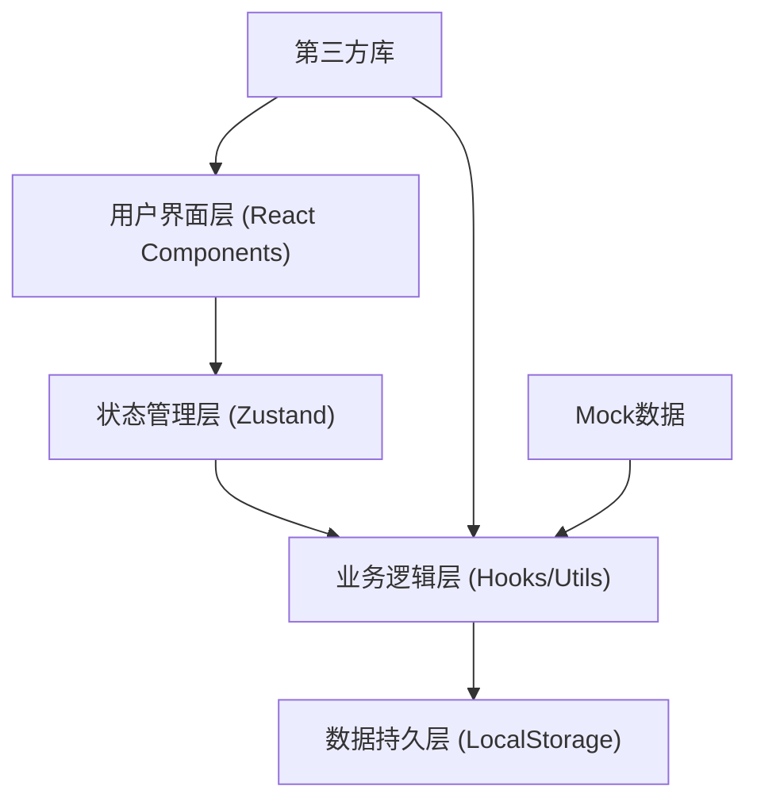

## 1. 架构设计

本项目为纯前端应用，采用模块化架构设计，所有数据存储于浏览器本地，支持离线使用。



### 架构说明

- **用户界面层**：基于React组件构建的7个功能模块UI，负责数据展示和用户交互
- **状态管理层**：使用Zustand进行全局状态管理，包括巡检数据、当前模块、主题配置等
- **业务逻辑层**：自定义Hooks封装业务逻辑，工具函数处理数据校验、格式转换等
- **数据持久层**：使用LocalStorage存储导入的数据、用户配置和方案
- **第三方库**：ECharts图表、html2canvas截图、file-saver文件导出等
- **Mock数据**：内置演示数据，支持无数据导入时的功能演示

## 2. 技术描述

- **前端框架**：React@18 + TypeScript@5
- **构建工具**：Vite@5
- **样式方案**：TailwindCSS@3.4.14 + PostCSS + Autoprefixer
- **状态管理**：Zustand@4（轻量级，无需Provider包裹）
- **图表库**：ECharts@5.4.3（功能强大的可视化图表）
- **图标库**：Lucide React（现代线性图标）
- **工具库**：
  - html2canvas@1.4.1（导出汇报图片）
  - file-saver@2.0.5（文件保存）
  - PapaParse@5.4.1（CSV/Excel文件解析）
  - uuid@9（唯一ID生成）
- **后端**：无（纯前端应用）
- **数据库**：LocalStorage（浏览器本地存储）
- **Mock数据**：内置JSON格式的演示数据，包含管段、阀门井、巡检记录、隐患、照片等

## 3. 模块/组件定义

| 模块/组件路径 | 功能描述 |
|--------------|---------|
| `src/App.tsx` | 应用主入口，路由/模块切换管理 |
| `src/main.tsx` | React应用挂载点 |
| `src/layouts/MainLayout.tsx` | 主布局组件，包含顶部导航和内容区域 |
| `src/components/Header.tsx` | 顶部导航栏，模块切换、主题切换、导出按钮 |
| `src/components/ModuleTabs.tsx` | 7个模块的标签页切换组件 |
| `src/modules/DataImport/index.tsx` | 数据导入模块 |
| `src/modules/PipeNetworkMap/index.tsx` | 管网地图模块 |
| `src/modules/InspectionRoute/index.tsx` | 巡检路线模块 |
| `src/modules/HazardList/index.tsx` | 隐患清单模块 |
| `src/modules/PhotoWall/index.tsx` | 照片墙模块 |
| `src/modules/Statistics/index.tsx` | 统计分析模块 |
| `src/modules/Settings/index.tsx` | 参数设置模块 |
| `src/store/useInspectionStore.ts` | 全局状态管理（巡检数据、用户配置） |
| `src/hooks/useFileImport.ts` | 文件导入Hook，处理解析和校验 |
| `src/hooks/useMapRenderer.ts` | 地图渲染Hook |
| `src/hooks/useStatistics.ts` | 统计计算Hook |
| `src/utils/validators.ts` | 字段校验工具函数 |
| `src/utils/exporters.ts` | 导出功能工具函数 |
| `src/utils/suggestions.ts` | 整改建议生成工具 |
| `src/types/index.ts` | TypeScript类型定义 |
| `src/mock/data.ts` | Mock演示数据 |
| `src/styles/globals.css` | 全局样式和TailwindCSS配置 |
| `src/styles/themes.ts` | 主题配置（深色/浅色/科技蓝） |

## 4. 核心数据结构定义

### 4.1 TypeScript 类型定义

```typescript
// 管段数据
interface PipeSegment {
  id: string;
  name: string;
  area: string;
  startPoint: [number, number];
  endPoint: [number, number];
  diameter: number;
  material: string;
  status: 'inspected' | 'uninspected';
  inspectedAt?: string;
  inspector?: string;
}

// 阀门井
interface ValveWell {
  id: string;
  name: string;
  position: [number, number];
  type: 'gate' | 'butterfly' | 'check';
  status: 'normal' | 'maintenance' | 'fault';
  lastInspection?: string;
}

// 巡检点
interface InspectionPoint {
  id: string;
  timestamp: string;
  position: [number, number];
  inspector: string;
  notes?: string;
  photos: string[];
}

// 巡检路线
interface InspectionRoute {
  id: string;
  name: string;
  date: string;
  inspector: string;
  points: InspectionPoint[];
  distance: number;
  duration: number;
}

// 隐患记录
interface Hazard {
  id: string;
  type: 'leak' | 'blockage' | 'damage' | 'other';
  level: 'minor' | 'moderate' | 'severe' | 'critical';
  location: string;
  position: [number, number];
  description: string;
  reporter: string;
  reportedAt: string;
  status: 'pending' | 'processing' | 'resolved';
  photos: string[];
  suggestion: string;
}

// 现场照片
interface Photo {
  id: string;
  url: string;
  thumbnail: string;
  title: string;
  takenAt: string;
  location: string;
  hazardId?: string;
  category: 'site' | 'hazard' | 'equipment';
  tags: string[];
}

// 巡检人员
interface Inspector {
  id: string;
  name: string;
  avatar?: string;
  inspectionCount: number;
  totalDistance: number;
  hazardReported: number;
}

// 统计数据
interface Statistics {
  totalPipes: number;
  inspectedPipes: number;
  totalValves: number;
  totalHazards: number;
  resolvedHazards: number;
  inspectionCount: number;
  totalDistance: number;
  topInspectors: Inspector[];
  hazardByType: Record<string, number>;
  hazardByLevel: Record<string, number>;
  monthlyComparison: {
    currentMonth: { inspections: number; hazards: number; distance: number };
    lastMonth: { inspections: number; hazards: number; distance: number };
  };
  trendData: { date: string; inspections: number; hazards: number }[];
}

// 应用配置
interface AppConfig {
  theme: 'dark' | 'light' | 'tech';
  legend: {
    inspectedColor: string;
    uninspectedColor: string;
    minorColor: string;
    moderateColor: string;
    severeColor: string;
    criticalColor: string;
  };
  exportFormat: 'png' | 'jpeg';
  exportQuality: number;
}

// 保存方案
interface SavedProject {
  id: string;
  name: string;
  createdAt: string;
  updatedAt: string;
  data: {
    pipes: PipeSegment[];
    valves: ValveWell[];
    routes: InspectionRoute[];
    hazards: Hazard[];
    photos: Photo[];
    inspectors: Inspector[];
  };
  config: AppConfig;
}
```

### 4.2 LocalStorage 数据键

| 键名 | 存储内容 | 类型 |
|-----|---------|------|
| `inspection_pipes` | 管段数据 | `PipeSegment[]` |
| `inspection_valves` | 阀门井数据 | `ValveWell[]` |
| `inspection_routes` | 巡检路线数据 | `InspectionRoute[]` |
| `inspection_hazards` | 隐患数据 | `Hazard[]` |
| `inspection_photos` | 照片数据 | `Photo[]` |
| `inspection_inspectors` | 巡检人员数据 | `Inspector[]` |
| `inspection_config` | 应用配置 | `AppConfig` |
| `inspection_projects` | 保存的方案列表 | `SavedProject[]` |

## 5. 核心功能实现说明

### 5.1 数据导入模块
- 支持拖拽上传和点击选择文件
- 支持CSV、JSON格式
- 使用PapaParse解析CSV文件
- 字段校验：必填字段检查、数据类型验证、坐标格式验证
- 导入进度实时显示
- 数据预览表格，支持字段映射调整

### 5.2 管网地图模块
- 使用Canvas/SVG绘制管网图
- 管段根据状态着色（已巡绿色/未巡灰色）
- 支持按区域筛选管段
- 阀门井标记为图标，点击显示详情
- 支持缩放、平移操作
- 图例说明面板

### 5.3 巡检路线模块
- 在地图上绘制巡检轨迹
- 播放/暂停控制，速度调节（0.5x/1x/2x）
- 轨迹动画效果，动态绘制路线
- 巡检点按时间轴依次点亮
- 进度条显示播放进度
- 显示当前巡检点信息

### 5.4 隐患清单模块
- 隐患列表展示，支持按类型、等级、状态筛选
- 新增隐患表单，支持选择位置、类型、等级
- 自动生成整改建议（根据隐患类型和等级）
- 隐患分级标签（轻微/一般/严重/危急）
- 状态徽章（待处理/处理中/已解决）
- 关联现场照片功能

### 5.5 照片墙模块
- 瀑布流布局展示照片
- 支持按分类（现场/隐患/设备）筛选
- 点击照片放大查看模态框
- 显示照片拍摄时间、地点、关联隐患
- 支持搜索功能（按标签、标题）

### 5.6 统计分析模块
- KPI指标卡片（总管段数、已巡率、隐患数、解决率）
- 人员工作量排名柱状图
- 问题类型分布饼图
- 本月/上月数据对比卡片
- 趋势折线图（近30天巡检和隐患趋势）
- 数据导出为CSV功能

### 5.7 参数设置模块
- 主题切换（深色/浅色/科技蓝）
- 图例颜色自定义
- 导出图片格式选择（PNG/JPEG）和质量设置
- 方案管理（保存/加载/删除）
- 数据清空功能
- 重置为默认配置

## 6. 项目文件结构

```
├── public/
│   └── mock-images/          # 演示用图片资源
├── src/
│   ├── assets/               # 静态资源
│   ├── components/           # 通用组件
│   │   ├── Header.tsx
│   │   ├── ModuleTabs.tsx
│   │   ├── Card.tsx
│   │   ├── Button.tsx
│   │   ├── Modal.tsx
│   │   └── Loading.tsx
│   ├── hooks/                # 自定义Hooks
│   │   ├── useFileImport.ts
│   │   ├── useMapRenderer.ts
│   │   ├── useStatistics.ts
│   │   └── useTheme.ts
│   ├── layouts/              # 布局组件
│   │   └── MainLayout.tsx
│   ├── mock/                 # Mock数据
│   │   ├── data.ts
│   │   └── images.ts
│   ├── modules/              # 业务模块
│   │   ├── DataImport/
│   │   ├── PipeNetworkMap/
│   │   ├── InspectionRoute/
│   │   ├── HazardList/
│   │   ├── PhotoWall/
│   │   ├── Statistics/
│   │   └── Settings/
│   ├── store/                # 状态管理
│   │   └── useInspectionStore.ts
│   ├── styles/               # 样式文件
│   │   ├── globals.css
│   │   └── themes.ts
│   ├── types/                # 类型定义
│   │   └── index.ts
│   ├── utils/                # 工具函数
│   │   ├── validators.ts
│   │   ├── exporters.ts
│   │   ├── suggestions.ts
│   │   └── storage.ts
│   ├── App.tsx
│   └── main.tsx
├── index.html
├── package.json
├── tsconfig.json
├── vite.config.ts
├── tailwind.config.js
└── postcss.config.js
```
